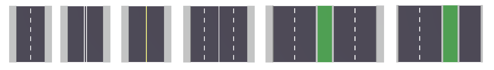
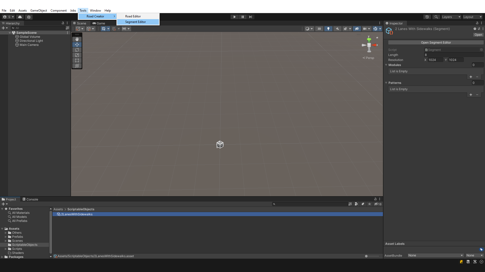
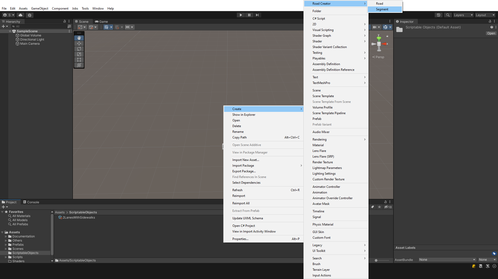
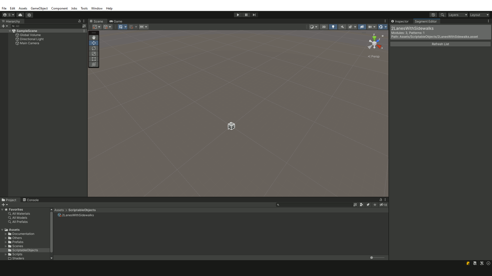
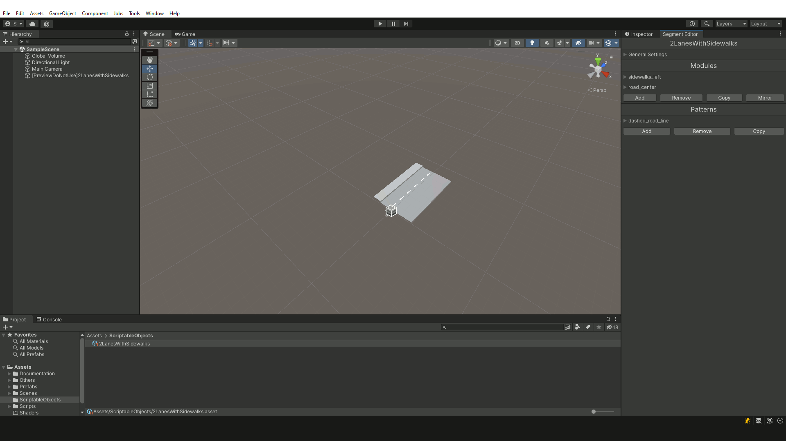
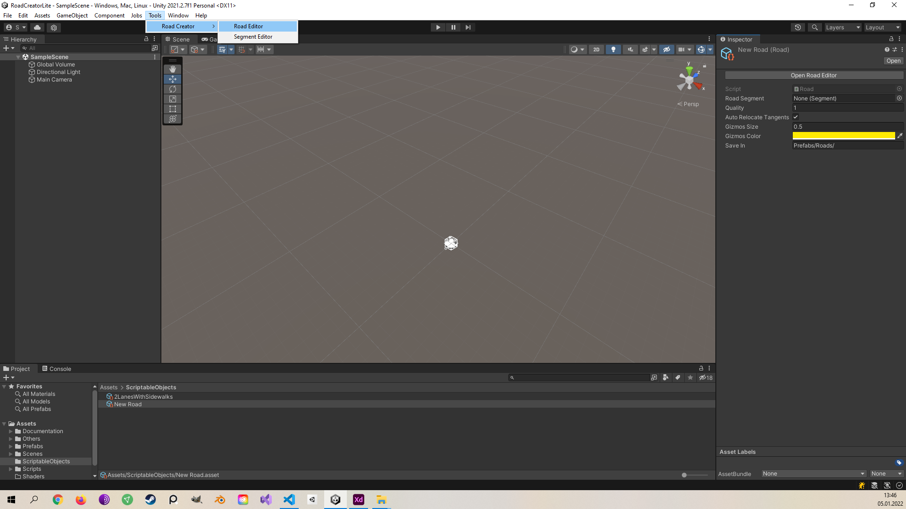
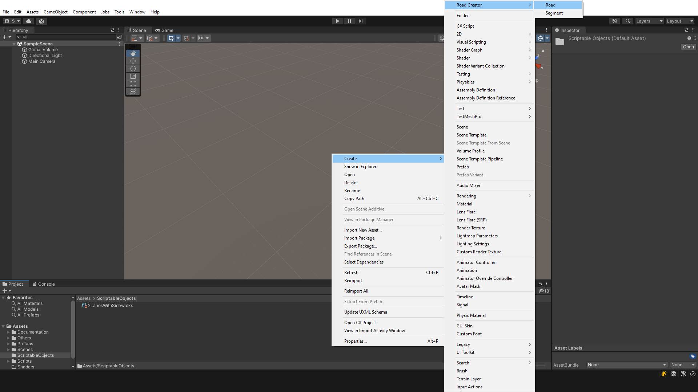
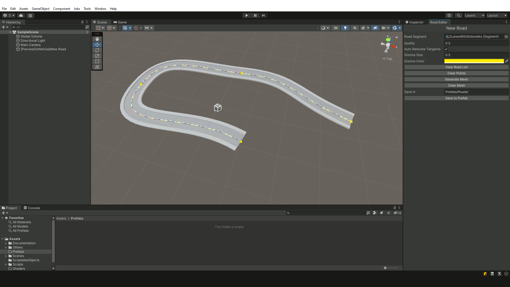
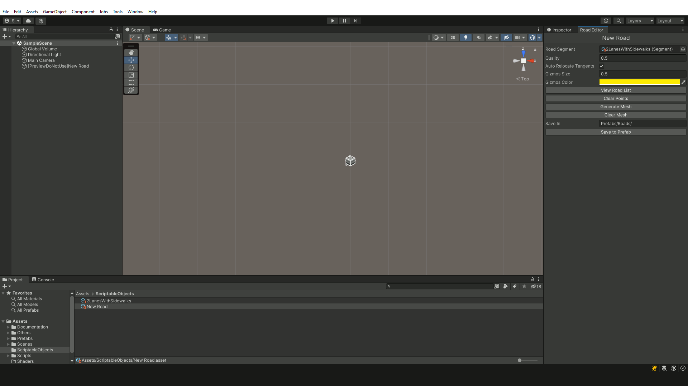

# Road Creator


# What is a Road Creator?

It is a simple tool for the Unity engine, allowing you to create your own low-poly style roads. Supports Universal Render Pipeline and Standard Render Pipeline.



# TO DO

- [ ] Add the following pattern types: Prefab and Texture.
- [ ] Refactoring and removing repetitive code.
- [ ] Ability to automatically adjust road to terrain.
- [ ] Procedural intersections.
- [ ] Add grid system.

# How to use?

Road Creator is divided into two editors:
- **Segment Editor** - in this editor, you create the appearance for the new road using modules and patterns.
- **Road Editor** - in this editor, you create a path that the created road will follow.

# Segment Editor

## Displaying the editor window

To view a list of created segment projects in a game project, select ```Tools/Road Creator/Segment Editor``` from the toolbar. You can also go directly to editing the selected segment by double-clicking on it or using the ```Open Segment Editor``` button in the inspector window.



## Creating a segment project

To create a segment project, select ```Create/Road Creator/Segment``` from the context menu.



## General Settings

```Length``` - is responsible for a base length of the segment needed to calculate UV coordinates for pattern texture. It is best to leave the default value.

```Resolution``` - specifies (in pixels) size of the texture assigned to the road, when the patterns are not too detailed the values can be reduced (for example 256x256).

```Generate Preview``` - creates a temporary model in the scene editor, displaying the road appearance. it should not be used. The model is deleted automatically when the segment editor window is closed.



```Clear Preview``` - removes the mesh and texture of the overview model.

```View Segment List``` - displays a list of all created segment projects in the game project files.

## Modules

Modules are used to define the geometry of the road. Each module consists of a name, a width, a height and a base color; there is no need to explain what these parameters mean. The buttons used to manipulate modules are described below.

```Add``` - adds a new module.

```Remove``` - removes selected module, if none is selected it removes the last one.

```Copy``` - copies the parameters of the selected modules and creates a new one with the same parameters.

```Mirror``` - if the following suffixes are included in the module name: ```_0```, ```_a```, ```_l```, ```_left``` or ```_1```, ```_b```, ```r```, ```_right``` will be created mirror images of these modules.



## Patterns

This section defines the patterns that will be placed on the road. Currently there is only one pattern type ```Fill``` with which you can create road lanes, markings, pedestrian crossings, etc. Below the list are buttons for manipulating the patterns, they have the same use as for the modules. The parameters of the patterns are described below:

```Name``` - the name of the pattern.


```Size``` - fill size in a single repetition.

```Tiling``` - the number of times the pattern repeats in the specified texture size.

```Offset``` - offset the entire pattern relative to the beginning of the texture.

```Symmetry X``` - create symmetry on the x-axis.

```Symmetry Y``` - create symmetry on the y-axis.

```Base Color``` - the base color of the pattern.

```Pattern Type``` - pattern type, currently only ```Fill``` is available.

# Road Editor

## Displaying the editor window

To view a list of created **road projects** in a game project, select ```Tools/Road Creator/Road Editor``` from the toolbar. You can also go directly to the editing selected road by double-clicking on it or using the ```Open Road Editor``` button in the inspector window.



## Creating a road project

To create a road project, select ```Create/Road Creator/Road``` from the context menu.



## Road editor interface

All the property fields found in the road editor window will be discussed below.

```Road Segment``` - you must assign a previously created segment project to define the appearance of the road.

```Quality``` - affects the number of sections between road points. The road becomes more detailed.

```Auto Relocate Tangents``` - automatically relocates tangents of road points.

```Gizmos Size``` - sets the size of interactive points representing road points (Does not affect the parameters of the generated road).

```Gizmos Color``` - the base color of points and control lines (Does not affect the parameters of the generated road).

```View Road List``` - displays a list of created road projects in the game project files.

```Clear Points``` - removes all road points.

```Generate Mesh``` - creates a temporary model in the editor scene, displaying the appearance of the entire road. It should not be used. The model is deleted automatically when the road editor window is closed.


```Clear Mesh``` - removes the mesh and texture of the overview model, leaving the road points that were added.

```Save In``` - the folder where the generated road prefab will be saved (Path relative to the Assets folder).

```Save to Prefab``` - saves the prefab together with its components: mesh, texture and material in the selected folder.



## Creating a road in the editor scene

**Adding** road points are done by holding down the ```Shift``` key and then ```left-clicking``` on the desired point in the scene.



Points are **deleted** by ```moving the mouse cursor``` over a selected road point and then clicking the ```D``` key.

**Moving** a road point or its tangent is done by ```hovering the mouse cursor``` over the selected road point and ```holding it down```.
